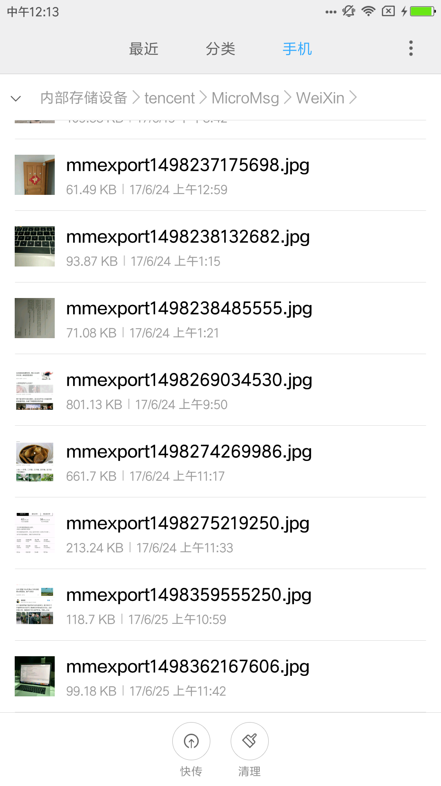
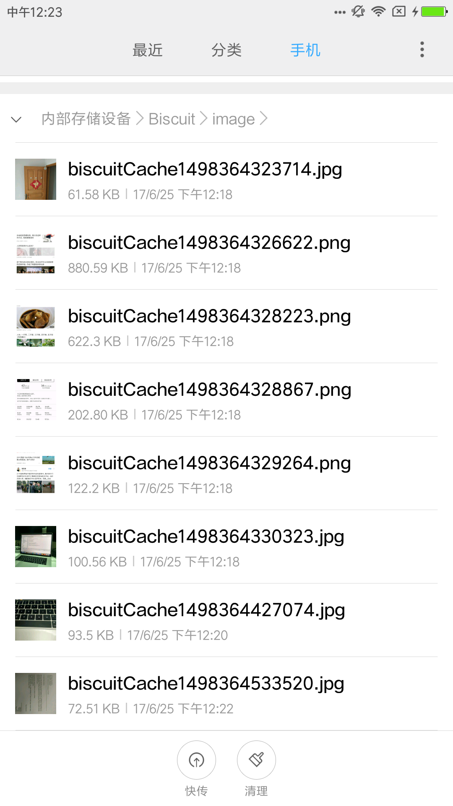

# Biscuit
[](https://jitpack.io/#pruas/Biscuit)

`Biscuit`是一个便捷的`android` 压缩图片库。由于微信是行业标杆，所以在写本库的时候，特意研究了下微信的压缩效果，以在小米`NOTE LTE`上为例，经过观察微信压缩效果，逆向推算出微信可能的压缩方式，发现微信很大概率上采用缩放压缩方式。于是本库采用两种压缩方式（采样率、缩放）供使用者选择使用，默认是采用和微信类似的缩放压缩方式并且效果非常接近！

# 功能
* 可以单张或者批量进行压缩
* 可以自定义保存路径
* 可以自定义压缩后是否使用原图名字命名
* 可以自定义压缩质量范围
* 可以选择缩放压缩或者采样率压缩
* 可以自定义执行器
* 可以自定义是否忽略透明度（忽略则质量差些，大小也将减小一半）
* OOM catch，避免Crash
* 可以清除缓存
* 压缩后拓展名不变
* 可以控制log输出
* 可以设置文件大小小于某个阈值的原图不压缩直接返回原图路径
* 提供同步方法syncCompress，同步压缩并返回压缩后路径，压缩失败返回原路径
* 提供压缩全部完成监听

# 压缩效果对比

先一睹为快！左边是微信压缩效果，右边是Biscuit压缩效果：

<a href="wechat_compressed.png"></a><a href="biscuit_compressed.png"></a>

上图中八张图片压缩数据对比：

原图 | `Biscuit` | `Wechat`
---- | ------ | ------
3120*4160/2.96MB|960*1280/61.58KB|960*1280/61.49KB
1080*9594/6.12MB|1019*9054/880.59KB|1019*9048/801.13KB
1080*5712/3.12MB|1080*5712/622.3KB|1080*5712/621.7KB
1080*2904/311KB|1080*2904/202.8KB|1080*2904/213.24KB
1080*1920/805KB|720*1280/122.2KB|720*1280/118.7KB
3120*4160/3.3MB|960*1280/100.56KB|960*1280/99.18KB
3120*4160/3.39MB|960*1280/93.5KB|960*1280/93.87KB
4160*3120/3.28MB|1280*960/72.57KB|1280*960/71.08KB

可以看到压缩后的图片宽高和微信非常一致！！！图片大小也几乎相等！！！

# 逆推算法推导

上面八张图，我们整理微信压缩后的宽高和原图做一次数据对比。宽高比，压缩比，这里为了方便分析，我们均取比例小于等于1。宽高比即以最小边除于最大边，并保留小数点后两位。同样的，压缩比即压缩后相应边除于原图相应边得到的比例。

原图 | `Wechat` | 宽高比 | 压缩比 | 序号
---- | ------ | ------ | ------ | ------
3120*4160|960*1280|0.75|0.30|`1`
1080*9594|1019*9048|0.11|0.94|`2`
1080*5712|1080*5712|0.19|1.00|`3`
1080*2904|1080*2904|0.37|1.00|`4`
1080*1920|720*1280|0.56|0.66|`5`
3120*4160|960*1280|0.75|0.30|`6`
3120*4160|960*1280|0.75|0.30|`7`
4160*3120|1280*960|0.75|0.30|`8`

以`（0，1）`区间分析上述宽高比数据，我们可以观察到，序号2、3、4宽高比落入`(0，0.5)`区间，序号5、1、6、7、8则落入`（0.5，1）`区间。
```
 0			0.5			1
  \______________________|______________________/   
    2、3、4                5、1、6、7、8     
```
下面我们先观察同个区间压缩后的数据，我们很容易发现宽高比落在`（0.5，1）`区间的压缩后的数据均包含`1280`这个特征数据。而且特征数据对应于原图长边，再观察以及计算，我们很容易发现特征数据等于原图长边乘以压缩比而得到，换句话说，压缩比等于特征数据除于原图长边。由此，我们可以做出初步假设：当宽高比落入`（0.5，1）`区间时，并且原图长边大于特征数据`1280`时，压缩比将由原图最长边除于特征数据`1280`决定。

再看落入`(0，0.5)`区间的数据，我们发现序号2的图片压缩后宽高有小幅度变化，其他两张并不压缩宽高。对于有压缩的那张，我们先观察宽高比和压缩比之间的联系，为了便于书写，我们以`y`代表压缩比，`x`代表宽高比，那么根据数据，我们可以大致得出一个初步的公式：
```
     y = 1-x/2      公式①
```

然后我们再套观察出来的公式①回去计算落在`（0，1）`区间上的数据，发现另外两张不压缩的图片按此公式压缩后的最短边均小于特征值1000，由此我们可以做出个假设：当宽高比落入区间`(0，0.5)`时，先按公式①计算出压缩比，然后以图片原图最小边乘以计算出来的压缩比得到的值大于特征值1000时，按公式①进行宽高压缩，否则不压缩。

根据以上分析，我们得出初步待完善的压缩比算法：
```java
    // SCALE_REFERENCE_WIDTH = 1280 , LIMITED_WIDTH = 1000
    private float calculateScaleSize(BitmapFactory.Options options) {
         float scale = 1f;
         int width = options.outWidth;
         int height = options.outHeight;
         int max = Math.max(width, height);
         int min = Math.min(width, height);
         float ratio = min / (max * 1f);//宽高比
         if (ratio >= 0.5f) {//落入区间（0.5，1）
             if (max > SCALE_REFERENCE_WIDTH) scale = SCALE_REFERENCE_WIDTH / (max * 1f);
         } else {//落入区间（0，0.5）
             if (min > LIMITED_WIDTH && (1 - (ratio / 2)) * min > LIMITED_WIDTH) {
                 scale = 1 - (ratio / 2);
             }
         }
         return scale;
     }
```
我们在此基础上去实验更长的长截图(极端情况)：

原图 | `Wechat` | 宽高比 | 压缩比 | 宽高倍数
---- | ------ | ------ | ------ | ------ 
1080*10884|1004*10110|0.09|0.93| 10
1080*18390|775*13192|0.05|0.72| 17

我们发现，虽然上表两张图落入区间`（0，0.5）`但是毕竟极端，宽高相差十倍以上或者说宽高比小于`0.1`，这个时候套上面我们观察得到的公式就不符合这种极端情况，所以我们得单独处理，正好，上面八张图中的第二张宽高相差在十倍以下，这就给我们提供个假设：当宽高相差大于十倍时，我们考虑另外的计算方式，而小于十倍时，我们仍然套用之前推导出来的公式。下面我们分析大于十倍的时候压缩比怎么来的。为了便于表达，我们以`y`代表压缩比，以`z`代表宽高倍数，我们根据数据，大致可以观察出其中的关系：
```
     y = 1-(z^2/1000)      公式②
```
根据观察得来的公式②我们反过去验证，再加权一些系数，以及不至于压缩太小我们限制压缩后的最小边不小于640，于是我们修改后的推导算法如下：

```java
    // SCALE_REFERENCE_WIDTH = 1280 , LIMITED_WIDTH = 1000 , MIN_WIDTH = 640
    private float calculateScaleSize(BitmapFactory.Options options) {
        float scale = 1f;
        int width = options.outWidth;
        int height = options.outHeight;
        int max = Math.max(width, height);
        int min = Math.min(width, height);
        float ratio = min / (max * 1f);
        if (ratio >= 0.5f) {
            if (max > SCALE_REFERENCE_WIDTH) scale = SCALE_REFERENCE_WIDTH / (max * 1f);
        } else {
            if ((max / min) < 10) {
                if (min > LIMITED_WIDTH && (1f - (ratio / 2f)) * min > LIMITED_WIDTH) {
                    scale = 1f - (ratio / 2f);
                }
            } else {
                int multiple = max / min;
                int arg = (int) Math.pow(multiple, 2);
                scale = 1f - (arg / LIMITED_WIDTH) + (multiple > 10 ? 0.01f : 0.03f);
                if (min * scale < Utils.MIN_WIDTH) {
                    scale = 1f;
                }
            }
        }
        return scale;
    }
```
到此，我们逆推宽高压缩基本完成。下面我们去推导质量压缩部分。质量压缩就简单了，一般为了不失真严重，我们建议压缩质量值在（60，90）之间，根据手机像素密度，给出一个质量值。规则是密度越大，压缩数值可以越低一些，反之，则大一些。规则如下：
```java
 static int DEFAULT_QUALITY = 66;
 static int DEFAULT_LOW_QUALITY = 60;
 static int DEFAULT_HEIGHT_QUALITY = 82;
 static int DEFAULT_X_HEIGHT_QUALITY = 88;
 static int DEFAULT_XX_HEIGHT_QUALITY = 94;
 static int getDefaultQuality(Context context) {
        DisplayMetrics dm = new DisplayMetrics();
        ((WindowManager) context.getSystemService(Context.WINDOW_SERVICE)).getDefaultDisplay().getMetrics(dm);
        float density = dm.density;
        if (density > 3f) {
            return DEFAULT_LOW_QUALITY;
        } else if (density > 2.5f && density <= 3f) {
            return DEFAULT_QUALITY;
        } else if (density > 2f && density <= 2.5f) {
            return DEFAULT_HEIGHT_QUALITY;
        } else if (density > 1.5f && density <= 2f) {
            return DEFAULT_X_HEIGHT_QUALITY;
        } else {
            return DEFAULT_XX_HEIGHT_QUALITY;
        }
    }
```

# Usage
Step 1. Add it in your root build.gradle at the end of repositories:
```gradle
	allprojects {
		repositories {
			...
			maven { url 'https://jitpack.io' }
		}
	}
```
Step 2. Add the dependency
```gradle
	dependencies {
	        compile 'com.github.pruas:Biscuit:v1.3.0'
	}
```
Step 3. Use it wherever you need
```java
                  Biscuit.with(this)
                        .path(photos)
                        .listener(mCompressListener)//压缩监听
                        .build()
                        .asyncCompress();//异步压缩
```
Or you can customize like this
```java
                Biscuit.with(this)
                        .path(photos) //可以传入一张图片路径，也可以传入一个图片路径列表进行批量压缩
                        .loggingEnabled(true)//是否输出log 默认输出
//                        .quality(50)//质量压缩值（0...100）默认已经非常接近微信，所以没特殊需求可以不用自定义
                        .originalName(true) //使用原图名字来命名压缩后的图片，默认不使用原图名字,随机图片名字
                        .listener(mCompressListener)//压缩监听,每压缩完成一张即回调一次监听
                        .listener(mOnCompressCompletedListener)//压缩完成监听，只有传入的所有图片都压缩结束才回调
                        .targetDir(FileUtils.getImageDir())//自定义压缩保存路径
//                        .executor(executor) //自定义实现执行，注意：必须在子线程中执行 默认使用HandlerThread执行
//                        .ignoreAlpha(true)//忽略alpha通道，对图片没有透明度要求可以这么做，默认不忽略。
//                        .compressType(Biscuit.SAMPLE)//采用采样率压缩方式，默认是使用缩放压缩方式，也就是和微信效果类似。
                        .ignoreLessThan(100)//忽略小于100kb的图片不压缩，返回原图路径
                        .build()
                        .asyncCompress();//异步压缩
```

rxjava executor:
```java
                    Biscuit.with(this)
                        .path(photos) //可以传入一张图片路径，也可以传入一个图片路径列表
                        .loggingEnabled(true)//是否输出log 默认输出
                        .listener(mCompressListener)//压缩监听
                        .targetDir(FileUtils.getImageDir())//自定义压缩保存路径
                        .executor(new Executor() {
                            @Override
                            public void execute(Runnable compressor) {
                                Observable.just(compressor).doOnNext(new Consumer<Runnable>() {
                                    @Override
                                    public void accept(Runnable runnable) throws Exception {
                                        runnable.run();
                                    }
                                }).subscribeOn(Schedulers.io()).subscribe();
                            }
                        }) //使用rxjava来执行
                        .ignoreLessThan(100)//忽略小于100kb的图片不压缩，返回原图路径
                        .build()
                        .asyncCompress();
```

rxjava execute:
```java
          Observable.just(photos).map(new Function<ArrayList<String>, ArrayList<String>>() {
                    @Override
                    public ArrayList<String> apply(@NonNull ArrayList<String> strings) throws Exception {
                        return Biscuit.with(MainActivity.this)
                                .path(strings)
                                .targetDir(FileUtils.getImageDir())
                                .ignoreLessThan(100)
                                .build().syncCompress();//同步方法
                    }
                }).subscribeOn(Schedulers.io()).observeOn(AndroidSchedulers.mainThread()).subscribe(new Consumer<ArrayList<String>>() {
                    @Override
                    public void accept(ArrayList<String> strings) throws Exception {
                        for (String compressedPath : strings) {
                            info.append("compressed success！ the image data has been saved at ");
                            info.append(compressedPath);
                            info.append("\n\n");
                        }
                        mTextView.setText(info.toString());
                    }
                });
```

Clear cache:
```java
Biscuit.clearCache(this);// default
```
or
```java
Biscuit.clearCache(FileUtils.getImageDir());//when you have set custom dir
```
# 说明
本库是在单一手机上测试，小米`Note 1080*1920`，所以如果你在使用本库过程中遇到什么问题，欢迎给我提`Issues` 。QQ交流群号:208317912。
